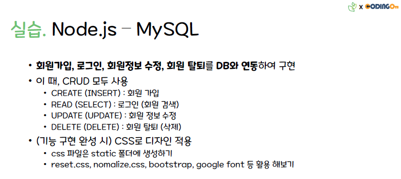
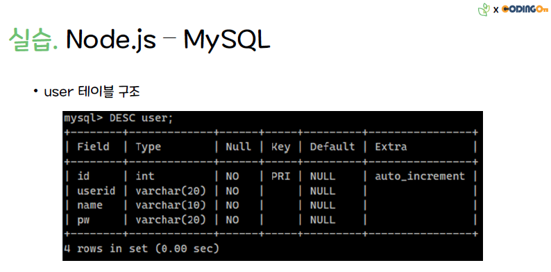

# MVC로 MySQL 연결 실습

### 실습. 회원가입, 로그인, 회원정보 수정, 회원 탈퇴를 DB와 연동하여 구현

 

## 요구 사항

### 조건1. 메인 페이지의 경로 /user, 나머지 경로도 /user로부터 시작하도록 설정

### 조건2. 프로필 페이지는 로그인 성공한 유저라면 프로필 페이지로 이동

 

### API 리스트

> **페이지 요청**  
> GET /user  
> GET /user/signin  
> GET /user/signup  

> **데이터 베이스 사용**  
> POST /user/profile/edit  
> POST /user/profile/delete  
> POST /user/signup  
> POST /user/signin  
> POST /user/profile
