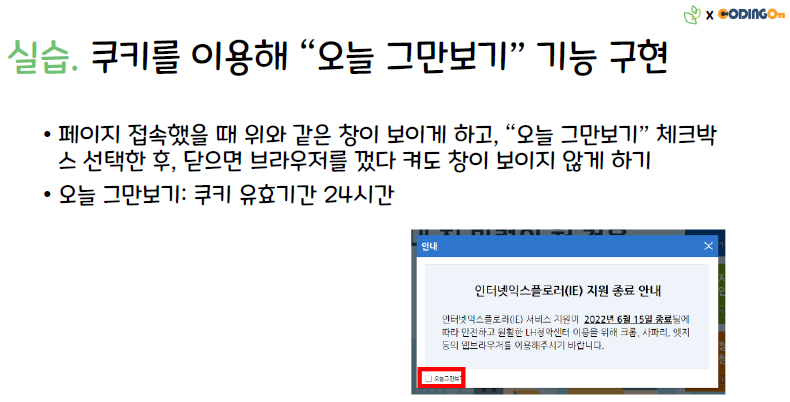

# 실습. Cookie를 이용해 "오늘 하루 보지 않기" 기능 구현

### 요구 사항

기본 제공 : views > index.ejs (HTML 파일)

1. 부트스트랩의 옵션을 활용해 모달 창 띄우기
   

2. 24시간 유효한 쿠키 생성
   - 모달 창의 체크박스 체크 시 **쿠키 생성 후** 모달 창 닫기
   - 체크 안했을 때는 쿠키 생성 없이 모달 창 닫기
