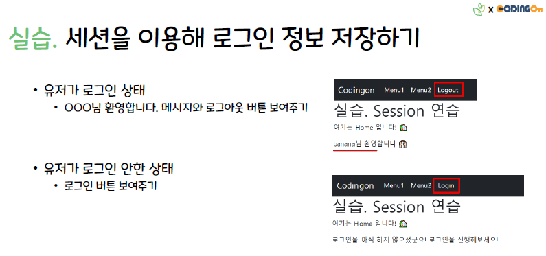

# 실습. session을 이용해 로그인, 로그아웃 기능 구현

기본 제공  

- views > .ejs 파일들  
- static > login.css

 

### 요구 사항

1. 로그인
   > - 로그인 버튼 클릭 -> 로그인 페이지로 이동
   > - 로그인 성공 -> 세션 설정(등록)

 

2. 로그인 여부 확인 후
   > - 로그인 안했을 경우 : 헤더에 `login` 버튼 표시
   > - 로그인 성공했을 경우 : 홈 화면에 유저 정보 나타내고, 헤더에 `login` 버튼 -> `logout` 버튼으로 변경

 

3. 로그아웃
   > - 로그아웃 버튼 누르면 세션 삭제
