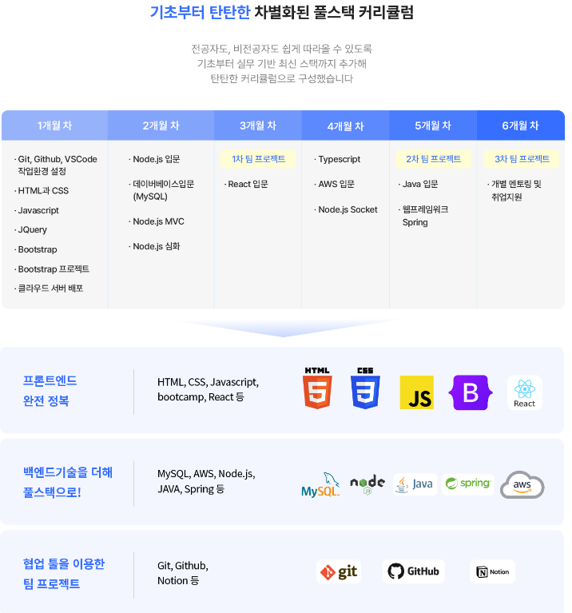

# [ SeSAC X 코딩온 ] 웹 개발자 풀스택 과정

서울시와 서울경제진흥원(SBA)에서 주관하고 검증된 교육기관의 전문가로부터 개발역량을 쌓을 수 있는 SW인재양성 교육 프로그램입니다.

   

> **교육 기간** : 23.12.27 (수) ~ 24.07.08 (월)
>  
> 매주 월, 수, 금 10:00 ~ 17:00 (휴게 1h 포함)

   

### 커리큘럼

   
   

## 📂 프론트엔드

학습 기간 : 2023.12.29 ~ 2024.01.24

### 학습 기록

| No  |      Contents       |                                                                                               Repository                                                                                                |                                                                                                                                                                                                                                                      Velog                                                                                                                                                                                                                                                      |       Period        |
| :-: | :-----------------: | :-----------------------------------------------------------------------------------------------------------------------------------------------------------------------------------------------------: | :-------------------------------------------------------------------------------------------------------------------------------------------------------------------------------------------------------------------------------------------------------------------------------------------------------------------------------------------------------------------------------------------------------------------------------------------------------------------------------------------------------------: | :-----------------: |
|  1  |        HTML         |                                                               [HTML](https://github.com/purple11-11/SeSAC-Dobong1-Web/tree/main/01_html)                                                                |                                                                                                                                                [HTML](https://velog.io/@purple11_11/SeSAC-X-%EC%BD%94%EB%94%A9%EC%98%A8-%EC%9B%B9%EA%B0%9C%EB%B0%9C%EC%9E%90-%ED%92%80%EC%8A%A4%ED%83%9D-%EA%B3%BC%EC%A0%95-1%EC%A3%BC%EC%B0%A8-%ED%9A%8C%EA%B3%A0-OT-HTML-CSS)                                                                                                                                                 |      23.12.29       |
|  2  |         CSS         |                                                                [CSS](https://github.com/purple11-11/SeSAC-Dobong1-Web/tree/main/02_CSS)                                                                 |                                        [CSS(1)](https://velog.io/@purple11_11/SeSAC-X-%EC%BD%94%EB%94%A9%EC%98%A8-%EC%9B%B9%EA%B0%9C%EB%B0%9C%EC%9E%90-%ED%92%80%EC%8A%A4%ED%83%9D-%EA%B3%BC%EC%A0%95-1%EC%A3%BC%EC%B0%A8-%ED%9A%8C%EA%B3%A0-OT-HTML-CSS), [CSS(2)](https://velog.io/@purple11_11/SeSAC-X-%EC%BD%94%EB%94%A9%EC%98%A8-%EC%9B%B9%EA%B0%9C%EB%B0%9C%EC%9E%90-%ED%92%80%EC%8A%A4%ED%83%9D-%EA%B3%BC%EC%A0%95-2%EC%A3%BC%EC%B0%A8-%ED%9A%8C%EA%B3%A0-CSS-JS)                                        | 24.01.03 ~ 24.01.08 |
|  3  |   JavaScript 기본   | [JavaScript 기본(1)](https://github.com/purple11-11/SeSAC-Dobong1-Web/tree/main/03_Javascript/1.8), [JavaScript 기본(2)](https://github.com/purple11-11/SeSAC-Dobong1-Web/tree/main/03_Javascript/1.10) |                                                                                                                                                 [JS 기본](https://velog.io/@purple11_11/SeSAC-X-%EC%BD%94%EB%94%A9%EC%98%A8-%EC%9B%B9%EA%B0%9C%EB%B0%9C%EC%9E%90-%ED%92%80%EC%8A%A4%ED%83%9D-%EA%B3%BC%EC%A0%95-2%EC%A3%BC%EC%B0%A8-%ED%9A%8C%EA%B3%A0-CSS-JS)                                                                                                                                                  | 24.01.08 ~ 24.01.10 |
|  4  |  JavaScript - DOM   |                                                         [JS-DOM](https://github.com/purple11-11/SeSAC-Dobong1-Web/tree/main/03_Javascript/1.12)                                                         | [JS-DOM(1)](https://velog.io/@purple11_11/SeSAC-X-%EC%BD%94%EB%94%A9%EC%98%A8-%EC%9B%B9%EA%B0%9C%EB%B0%9C%EC%9E%90-%ED%92%80%EC%8A%A4%ED%83%9D-%EA%B3%BC%EC%A0%95-2%EC%A3%BC%EC%B0%A8-%ED%9A%8C%EA%B3%A0-CSS-JS), [JS-DOM(2)](https://velog.io/@purple11_11/SeSAC-X-%EC%BD%94%EB%94%A9%EC%98%A8-%EC%9B%B9%EA%B0%9C%EB%B0%9C%EC%9E%90-%ED%92%80%EC%8A%A4%ED%83%9D-%EA%B3%BC%EC%A0%95-3%EC%A3%BC%EC%B0%A8-%ED%9A%8C%EA%B3%A0-JS-jQuery-%EB%B0%98%EC%9D%91%ED%98%95-%EB%B6%80%ED%8A%B8%EC%8A%A4%ED%8A%B8%EB%9E%A9) |      24.01.12       |
|  5  |       jQuery        |      [jQuery(1)](https://github.com/purple11-11/SeSAC-Dobong1-Web/tree/main/03_Javascript/1.15/jQuery), [jQuery(2)](https://github.com/purple11-11/SeSAC-Dobong1-Web/tree/main/03_Javascript/1.17)      |                                                                                                           [jQuery](https://velog.io/@purple11_11/SeSAC-X-%EC%BD%94%EB%94%A9%EC%98%A8-%EC%9B%B9%EA%B0%9C%EB%B0%9C%EC%9E%90-%ED%92%80%EC%8A%A4%ED%83%9D-%EA%B3%BC%EC%A0%95-3%EC%A3%BC%EC%B0%A8-%ED%9A%8C%EA%B3%A0-JS-jQuery-%EB%B0%98%EC%9D%91%ED%98%95-%EB%B6%80%ED%8A%B8%EC%8A%A4%ED%8A%B8%EB%9E%A9)                                                                                                            | 24.01.15 ~ 24.01.17 |
|  6  | 반응형 & 부트스트랩 |     [반응형](https://github.com/purple11-11/SeSAC-Dobong1-Web/tree/main/03_Javascript/1.17), [부트스트랩](https://github.com/purple11-11/SeSAC-Dobong1-Web/tree/main/03_Javascript/1.19/Bootstrap)      |                                                                                                     [반응형 & 부트스트랩](https://velog.io/@purple11_11/SeSAC-X-%EC%BD%94%EB%94%A9%EC%98%A8-%EC%9B%B9%EA%B0%9C%EB%B0%9C%EC%9E%90-%ED%92%80%EC%8A%A4%ED%83%9D-%EA%B3%BC%EC%A0%95-3%EC%A3%BC%EC%B0%A8-%ED%9A%8C%EA%B3%A0-JS-jQuery-%EB%B0%98%EC%9D%91%ED%98%95-%EB%B6%80%ED%8A%B8%EC%8A%A4%ED%8A%B8%EB%9E%A9)                                                                                                     | 24.01.17 ~ 24.01.19 |
|  7  |   JavaScript 심화   |                                                  [JavaScript 심화](https://github.com/purple11-11/SeSAC-Dobong1-Web/tree/main/03_Javascript/upgradeJS)                                                  |                                                                                                                                                                                                                                                [JavaScript 심화]                                                                                                                                                                                                                                                | 24.01.22 ~ 24.01.24 |

### 실습

| No  | Contents | Period |
| :-: | :------: | :----: |
|  1  |      |    |

   
   

## 📂 백엔드

학습 기간 : 2024.01.24 ~

### 학습 기록

| No  |         Contents         |                                                                           Repository                                                                            |                                                                                                                                                       Velog                                                                                                                                                       |       Period        |
| :-: | :----------------------: | :-------------------------------------------------------------------------------------------------------------------------------------------------------------: | :---------------------------------------------------------------------------------------------------------------------------------------------------------------------------------------------------------------------------------------------------------------------------------------------------------------: | :-----------------: |
|  1  |      Node.js, 모듈       |                                       [Node.js, 모듈](https://github.com/purple11-11/SeSAC-Dobong1-Web/tree/main/04_node)                                       |                                                                                                                                                     [Node.js]                                                                                                                                                     | 24.01.22 ~ 24.01.24 |
|  2  |      express & ejs       |                                   [express & ejs](https://github.com/purple11-11/SeSAC-Dobong1-Web/tree/main/05_express/1.24)                                   |                                                                                                                                                  [express & ejs]                                                                                                                                                  |      24.01.24       |
|  3  |        비동기처리        |                                 [비동기처리](https://github.com/purple11-11/SeSAC-Dobong1-Web/blob/main/05_express/1.24/app.js)                                 |                                                                                                                                                   [비동기처리]                                                                                                                                                    |      24.01.24       |
|  4  |       `<form>`태그       |                                       [`<form>`태그](https://github.com/purple11-11/SeSAC-Dobong1-Web/tree/main/07_form)                                        |       [`<form>`태그](https://velog.io/@purple11_11/SeSAC-X-%EC%BD%94%EB%94%A9%EC%98%A8-%EC%9B%B9%EA%B0%9C%EB%B0%9C%EC%9E%90-%ED%92%80%EC%8A%A4%ED%83%9D-%EA%B3%BC%EC%A0%95-4%EC%A3%BC%EC%B0%A8-%ED%9A%8C%EA%B3%A0-3-form-%ED%83%9C%EA%B7%B8-GETPOST-nodemon-%EC%9C%A0%ED%9A%A8%EC%84%B1-%EA%B2%80%EC%82%AC)       |      24.01.26       |
|  5  |       동적폼 전송        |                                    [동적폼 전송](https://github.com/purple11-11/SeSAC-Dobong1-Web/tree/main/08_dynamic/1.29)                                    |                                                                                                                                                   [동적폼 전송]                                                                                                                                                   |      24.01.29       |
|  6  |          multer          |                                       [multer](https://github.com/purple11-11/SeSAC-Dobong1-Web/tree/main/09_multer/1.31)                                       |                                                                                                                                                     [multer]                                                                                                                                                      |      24.01.31       |
|  7  |   데이터베이스(MySQL)    |                                     [데이터베이스](https://github.com/purple11-11/SeSAC-Dobong1-Web/tree/main/10_database)                                      |                 [데이터베이스(1)](https://velog.io/@purple11_11/SeSAC-X-%EC%BD%94%EB%94%A9%EC%98%A8-%EC%9B%B9%EA%B0%9C%EB%B0%9C%EC%9E%90-%ED%92%80%EC%8A%A4%ED%83%9D-%EA%B3%BC%EC%A0%95-7%EC%A3%BC%EC%B0%A8-%ED%9A%8C%EA%B3%A0-1-%EB%8D%B0%EC%9D%B4%ED%84%B0-%EB%B2%A0%EC%9D%B4%EC%8A%A4-DDL-DML)                 | 24.02.05 ~ 24.02.07 |
|  8  |         MVC 패턴         |                                          [MVC 패턴](https://github.com/purple11-11/SeSAC-Dobong1-Web/tree/main/11_mvc)                                          |                                                                                                                                                    [MVC 패턴]                                                                                                                                                     |      24.02.07       |
|  9  |      MVC_MySQL 연동      |                                      [MVC_MySQL](https://github.com/purple11-11/SeSAC-Dobong1-Web/tree/main/12_mvc_mysql)                                       |                                                                                                                                                    [MVC_MySQL]                                                                                                                                                    |      24.02.14       |
| 10  |     .env & sequelize     | [.env](https://github.com/purple11-11/SeSAC-Dobong1-Web/tree/main/99_env), [sequelize](https://github.com/purple11-11/SeSAC-Dobong1-Web/tree/main/13_sequelize) | [.env & sequelize](https://velog.io/@purple11_11/SeSAC-X-%EC%BD%94%EB%94%A9%EC%98%A8-%EC%9B%B9%EA%B0%9C%EB%B0%9C%EC%9E%90-%ED%92%80%EC%8A%A4%ED%83%9D-%EA%B3%BC%EC%A0%95-8%EC%A3%BC%EC%B0%A8-%ED%9A%8C%EA%B3%A0-2-MVCMySQL-%EC%97%B0%EA%B2%B0-%EC%8B%A4%EC%8A%B5-%ED%99%98%EA%B2%BD-%EB%B3%80%EC%88%98-sequelize) |      24.02.16       |
| 11  | sequelize 심화(Relation) |                               [sequelize 심화](https://github.com/purple11-11/SeSAC-Dobong1-Web/tree/main/14_sequelize_relation)                                |                         [sequelize 심화(relation)](https://velog.io/@purple11_11/SeSAC-X-%EC%BD%94%EB%94%A9%EC%98%A8-%EC%9B%B9%EA%B0%9C%EB%B0%9C%EC%9E%90-%ED%92%80%EC%8A%A4%ED%83%9D-%EA%B3%BC%EC%A0%95-9%EC%A3%BC%EC%B0%A8-%ED%9A%8C%EA%B3%A0-1-sequelize-%EC%8B%AC%ED%99%94-relation)                          |      24.02.19       |
| 12  |        쿠키, 세션        |                                   [쿠키, 세션](https://github.com/purple11-11/SeSAC-Dobong1-Web/tree/main/15_cookie_session)                                    |                                                                                                                                                   [쿠키, 세션]                                                                                                                                                    |      24.02.21       |

### 실습

| No  |                                                          Contents                                                          |       Period        |
| :-: | :------------------------------------------------------------------------------------------------------------------------: | :-----------------: |
|  1  |                [multer 실습](https://github.com/purple11-11/SeSAC-Dobong1-Web/tree/main/09_multerPractice)                 | 24.02.01 ~ 24.02.02 |
|  2  |                 [express 실습](https://github.com/purple11-11/SeSAC-Dobong1-Web/tree/main/99_express_blog)                 | 24.02.02 ~ 24.02.03 |
|  3  |                   [MVC 실습](https://github.com/purple11-11/SeSAC-Dobong1-Web/tree/main/11_practice_mvc)                   | 24.02.07 ~ 24.02.08 |
|  4  |             [MVC_MySQL 실습](https://github.com/purple11-11/SeSAC-Dobong1-Web/tree/main/12_practice_mysql_mvc)             | 24.02.14 ~ 24.02.16 |
|  5  |                 [sequelize 실습](https://github.com/purple11-11/SeSAC-Dobong1-Web/tree/main/13_sequelize)                  |      24.02.17       |
|  6  | [Cookie로 "오늘 하루 보지 않기" 기능 구현](https://github.com/purple11-11/SeSAC-Dobong1-Web/tree/main/15_practice_cookie)  |      24.02.21       |
|  7  | [Session으로 "로그인, 로그아웃" 기능 구현](https://github.com/purple11-11/SeSAC-Dobong1-Web/tree/main/15_practice_session) |      24.02.21       |
